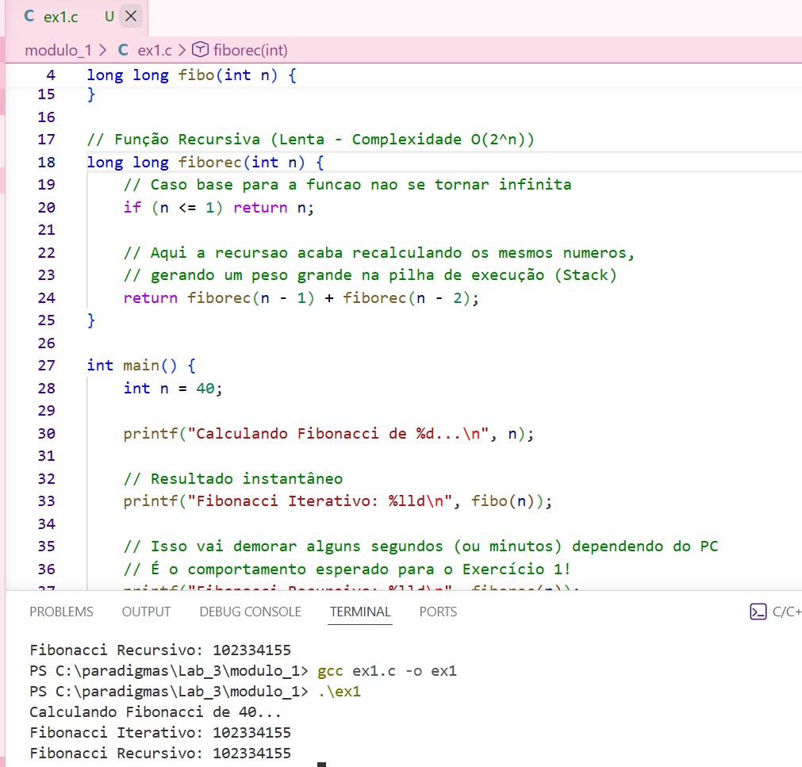
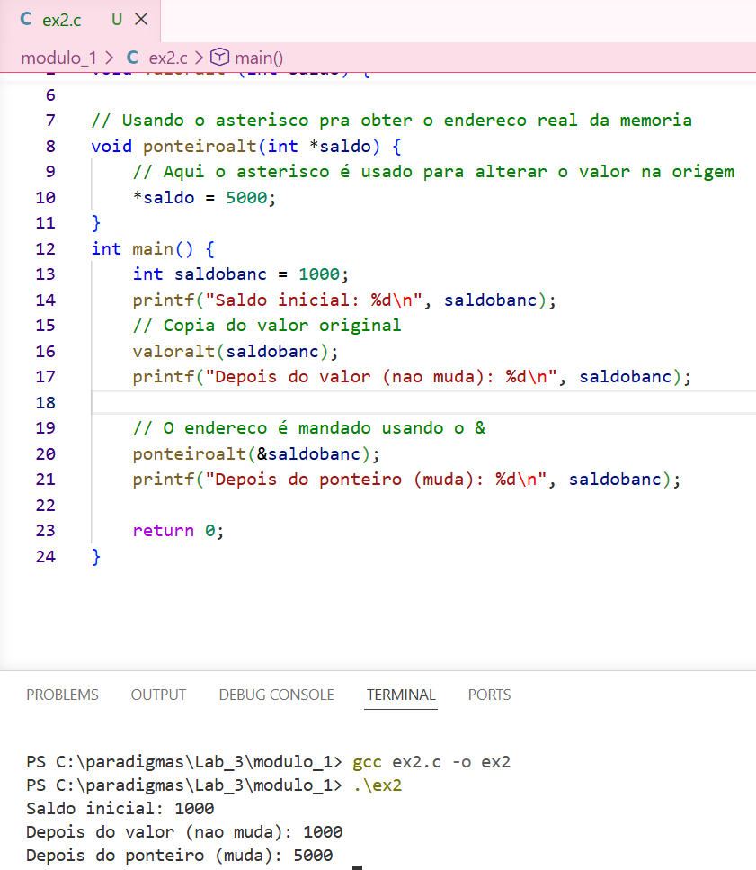
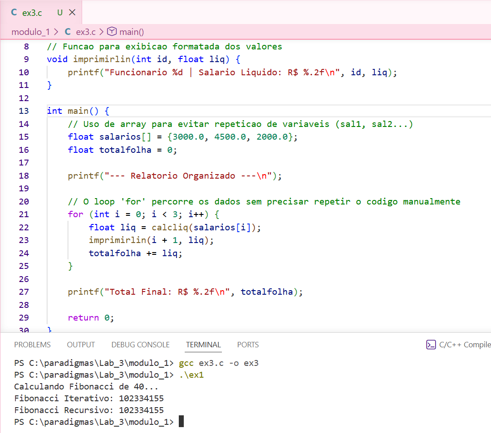
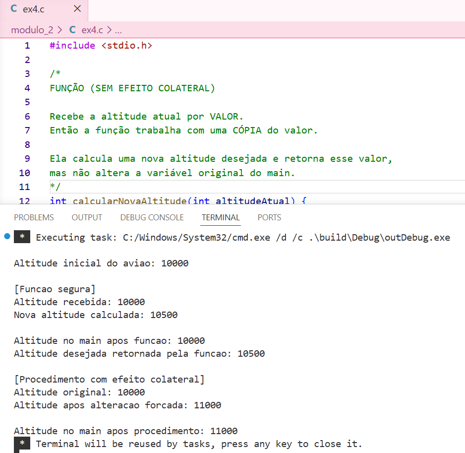
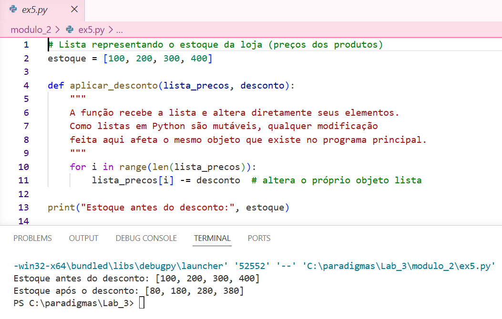
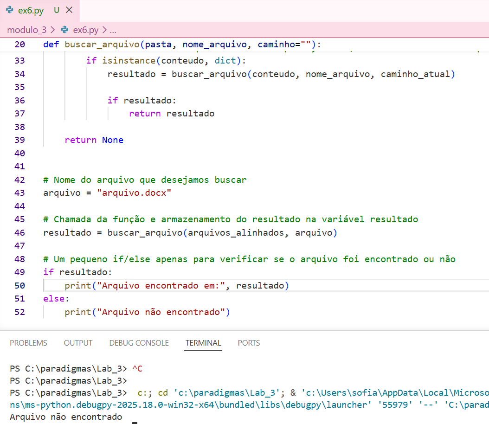
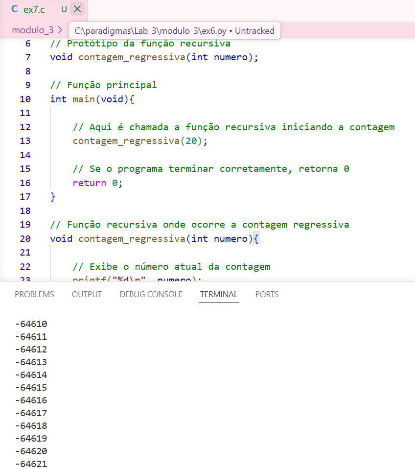
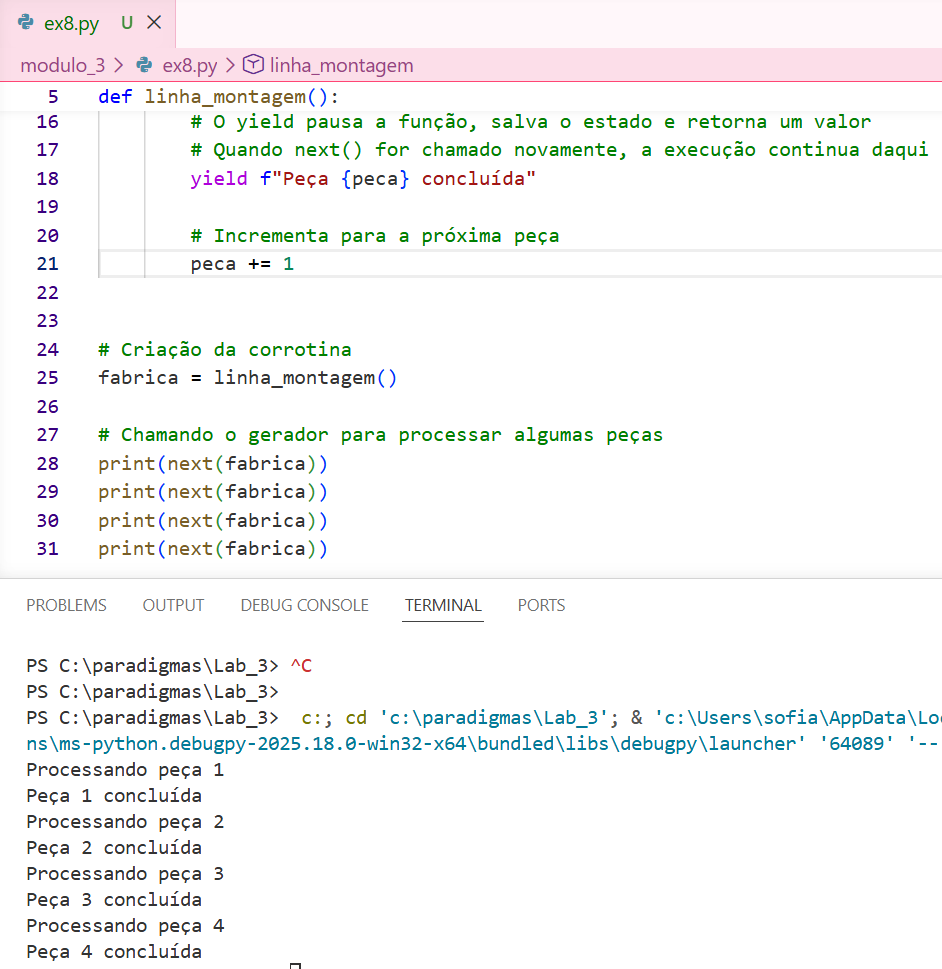
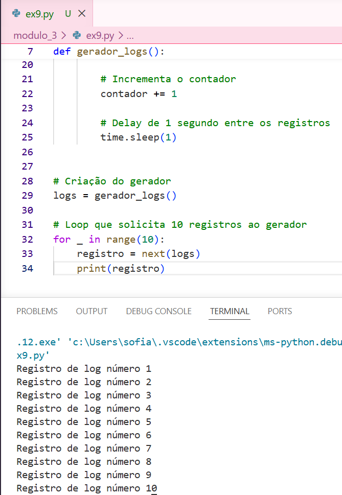
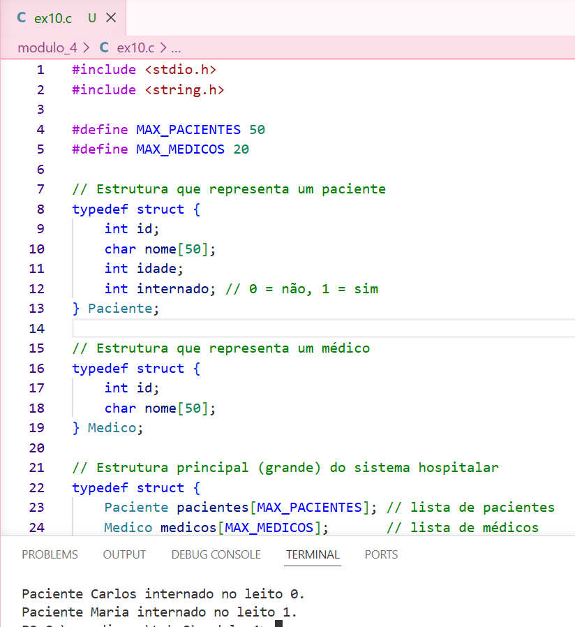

# Laboratório 3 - Paradigmas da Programação

Este repositório contém a resolução de 10 exercícios focados em fundamentos de memória, escopo, mutabilidade e controle de fluxo cooperativo, organizados em 4 módulos.

## Equipe
* **[Sofia Tiengo Rovaron]** - Responsável pelo Módulo 2.
* **[Rodrigo Gabriel de Araujo Durigan]** - Módulo 1.
* **[Heloísa Bragatto Beraldo]** - Módulo 3.
* **[Anna Heloisy Raymundo Nicolau]** - Módulo 4.

𓆝 𓆟 𓆞 𓆝 𓆟𓆝 𓆟 𓆞 𓆝 𓆟

## Comprovação Visual (Prints de Execução)

Abaixo estão as capturas de tela demonstrando a compilação e o funcionamento de cada exercício.

### Módulo 1: Fundamentos, Memória e Escopo

  
Exercício 1 - Custo Computacional (Fibonacci)

   
  

  
Exercício 2 - Proteção de Escopo (Saldo Bancário)

   
  

  
Exercício 3 - Refatoração e Alta Coesão (Folha de Pagamento)

   
  

### Módulo 2: Parâmetros, Mutabilidade e Efeitos Colaterais

  
Exercício 4 - Simulador de Efeito Colateral (Altitude)

   
  

  
Exercício 5 - Perigo do Call-by-sharing (Estoque Python)

   
  

### Módulo 3: Refinamento Avançado (Recursividade e Corrotinas)

  
Exercício 6 - Elegância Declarativa (Busca em Árvore)

   
  

  
Exercício 7 - Prevenindo o Stack Overflow

   
  

  
Exercício 8 - Controle de Fluxo Cooperativo (Yield)

   
  

  
Exercício 9 - Avaliação Preguiçosa (Lazy Evaluation)

   
  

### Módulo 4: O Limite Procedural (A Crise do Estado)

  
Exercício 10 - Colapso da Estrutura (Sistema Hospitalar)

   
  

